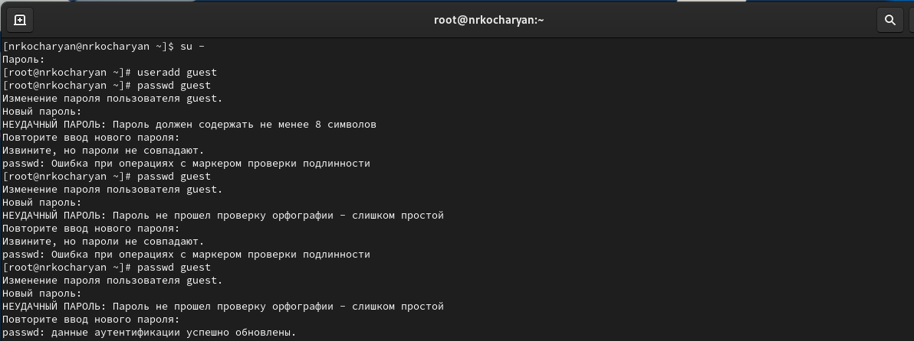
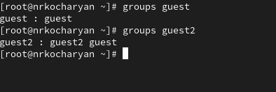
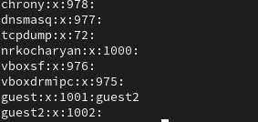

---
## Front matter
lang: ru-RU
title: Лабораторная работа № 3
subtitle: Дискреционное разграничение прав в Linux. Два пользователя
author:
  - Кочаярн Никита Робеотович
institute:
  - Российский университет дружбы народов, Москва, Россия
date: 16 марта 2024

## i18n babel
babel-lang: russian
babel-otherlangs: english

## Formatting pdf
toc: false
toc-title: Содержание
slide_level: 2
aspectratio: 169
section-titles: true
theme: metropolis
header-includes:
 - \metroset{progressbar=frametitle,sectionpage=progressbar,numbering=fraction}
 - '\makeatletter'
 - '\beamer@ignorenonframefalse'
 - '\makeatother'
---

# Информация

## Докладчик

:::::::::::::: {.columns align=center}
::: {.column width="70%"}

  * Кочарян Никита Робертович
  * Студент группы НБИбд-03-22
  * Российский университет дружбы народов
:::
::: {.column width="30%"}

:::
::::::::::::::

## Цели и задачи

-Получение практических навыков работы в консоли с атрибутами файлов для групп пользователей.

## Выполнение лабораторной работы

1.  Используя учетную запись администратора создаем учетную запись guest и задаем ей пароль.

{#fig:001 width=70%}

##

2.  Создаем пользователя guest2 и задаем ему пароль.

{#fig:002 width=70%}

##

3.  Добавляем пользователя guest2 в группу guest 

{#fig:003 width=70%}

##

4.  Осуществляем вход в систему от двух пользователей на двух разных консолях: guest на первой консоли и guest2 на второй консоли.

{#fig:004 width=50%}

{#fig:005 width=50%}

##

5.  Для обоих пользователей командой pwd определяем директорию, в которой мы находимся.

{#fig:006 width=50%}

{#fig:007 width=50%}

##

6.  Уточняем имя нашего пользователя, его группу, кто входит в нее и к каким группам принадлежит он сам. Определяем командами groups guest и groups guest2, в какие группы входят пользователи guest и guest2. Сравниваем вывод команды groups с выводом команд id в консоли с атрибутами файлов для групп пользователей.-Gn и id -G

{#fig:008 width=50%}

{#fig:009 width=50%}

##

{#fig:010 width=50%}

{#fig:011 width=50%}

##

{#fig:012 width=70%}

##

7.  Сравнивакм полученную информацию с содержимым файла /etc/group.

{#fig:013 width=50%}

{#fig:014 width=50%}

##

8.  От имени пользователя guest2 выполяем регистрацию пользователя guest2 в группе guest

{#fig:015 width=70%}

##

9.  От имени пользователя guest изменяем права директории /home/guest, разрешив все действия для пользователей группы

{#fig:016 width=70%}

##

10. От имени пользователя guest снимаем с директории /home/guest/dir1 все атрибуты

{#fig:017 width=70%}

## Результаты

С помощью данной лабораторной работы мы  получили практических навыков работы в консоли с атрибутами файлов для групп пользователей.

