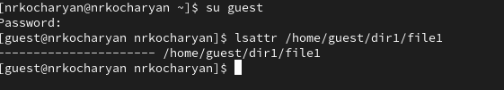
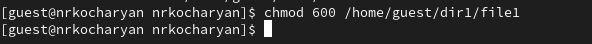
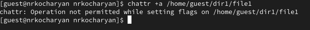
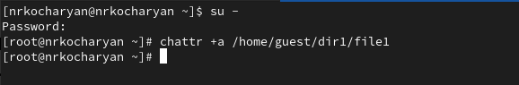
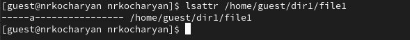
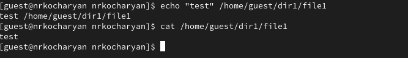
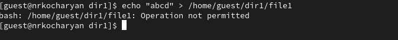
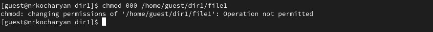
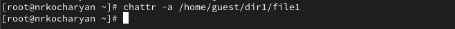
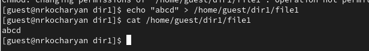

---
## Front matter
lang: ru-RU
title: Лабораторная работа № 4
subtitle: Дискреционное разграничение прав в Linux. Расширенные атрибуты.
author:
  - Кочаярн Никита Робеотович
institute:
  - Российский университет дружбы народов, Москва, Россия
date: 30 марта 2024

## i18n babel
babel-lang: russian
babel-otherlangs: english

## Formatting pdf
toc: false
toc-title: Содержание
slide_level: 2
aspectratio: 169
section-titles: true
theme: metropolis
header-includes:
 - \metroset{progressbar=frametitle,sectionpage=progressbar,numbering=fraction}
 - '\makeatletter'
 - '\beamer@ignorenonframefalse'
 - '\makeatother'
---

# Информация

## Докладчик

:::::::::::::: {.columns align=center}
::: {.column width="70%"}

  * Кочарян Никита Робертович
  * Студент группы НБИбд-03-22
  * Российский университет дружбы народов
:::
::: {.column width="30%"}

:::
::::::::::::::

## Цели и задачи

Получение практических навыков работы в консоли с расширенными атрибутами файлов.

## Выполнение лабораторной работы

1.  От имени пользователя guest определите расширенные атрибуты файла /home/guest/dir1/file1

{#fig:001 width=70%}

##

2.  Устанавливаем на file1 права, разрешающие чтение и запись для владельца файла.

{#fig:002 width=70%}

##

3.  Пробуем установить на файл file1  расширенный атрибут a от имени пользователя guest. Получаем отказ.

{#fig:003 width=70%}

##

4.  Заходим на третью консоль с правами администратора. Устанавливаем расширенный атрибут а на файл file1 от имени супер-пользователя.

{#fig:004 width=70%}

##

5.  От имени пользователя guest проверяем правильность установления атрибута:

{#fig:005 width=70%}

##

6.  Выполняем дозапись в файл file1 слова «test». После этого выполянем чтение файла file1.

{#fig:006 width=50%}

##

7.  Пробуем удалить файл file1 либо стереть имеющуюся в нём информацию

{#fig:07 width=70%}

##

8.  Пробуем установить на файл file1 права, например, запрещающие чтение и запись для владельца файла. Получаем отказ.

{#fig:08 width=70%}

##

9.  Снимаю расширенный атрибут a с файла file1 от имени суперпользователя.

{#fig:019 width=70%}

##

10. Снова пробуем удалить файл file1 либо стереть имеющуюся в нём информацию.

{#fig:010 width=70%}

## Результаты

В результате выполнения работы мы повысили свои навыки использования интерфейса командой строки (CLI), познакомились на примерах с тем, как используются основные и расширенные атрибуты при разграничении доступа. Имели возможность связать теорию дискреционного разделения доступа (дискреционная политика безопасности) с её реализацией на практике в ОС Linux. Составили наглядные таблицы, поясняющие какие операции возможны при тех или иных установленных правах. Опробовали действие на практике расширенных атрибутов «а» и «i».

